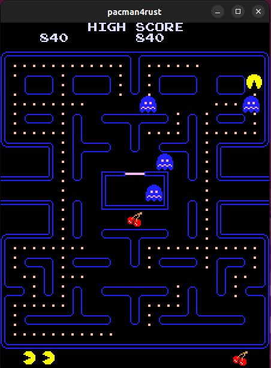

# pacman4rust v1.0.0

## Description

pacman4rust contains a Z80 emulator and emulates the original Pac-Man game.
In order to play the game, you need to get the original ROM files:

SHA256(82s123.7f) = 48fe0b01d68e3d702019ca715f7266c8e3261c769509b281720f53ca0a1cc8fb
SHA256(82s126.1m) = 8e723ad91e46ef1a186b2ed3c99a8bf1c571786bc7ceae2b367cbfc80857a394
SHA256(82s126.3m) = 8c34002652e587aa19a77bff9040d870af18b4b2fe5c5f0ed962899386e0e751
SHA256(82s126.4a) = ef8f7a3b0c10f787d9cc1cbc5cc266fcc1afadb24c3b4d610fe252b9c3df1d76
SHA256(pacman.5e) = 8d9a86c97fe94b1fd010b139672c330e3b257ba59b0d8df7a821592e30a77b4b
SHA256(pacman.5f) = 49c8f656cb8ea1ae02fb64a2c09df98e7f06a034b43c6c8240032df417c6d36f
SHA256(pacman.6e) = fe1c3234df345855d30728637f361f79472cabfe2a892a7567c63eaf31a4217b
SHA256(pacman.6f) = 09a723c9f84790e9019633e37761cfa4e9d7ab6db14f6fdb12738f51fec11065
SHA256(pacman.6h) = 69347409739b64ed9d9b19713de0bc66627bd137687de649796b9d2ef88ed8e6
SHA256(pacman.6j) = 03ee523c210e87fb8dd1d925b092ad269fdd753b5b7a20b3757b0ceee5f18679

pacman.zip Namco (Midway license)

And copy the files to the roms directory.



This port is based on pac by superzazu:

* [pac](https://github.com/superzazu/pac)

The z80 emulator by superzazu as well:

* [z80](https://github.com/superzazu/z80)

Original Pacman by Namco:

* [Pac-Man](https://pt.wikipedia.org/wiki/Pac-Man)

This book helps understanding how the arcade game were made:

* [The Book of CP-SYSTEM](https://fabiensanglard.net/cpsb/)

## Dependencies

* [Rust-SDL2](https://github.com/Rust-SDL2/rust-sdl2)

## Build and run

### Install SDL2:

#### Ubuntu

sudo apt install libsdl2-2.0-0

sudo apt install libsdl2-dev

#### CentOS

sudo dnf --enablerepo=powertools install SDL2

sudo dnf --enablerepo=powertools install SDL2-devel

#### macOS

brew install sdl2

```
cargo build --release

cargo run --release

```

## Author

* [Antonio Soares](https://github.com/ccie18473)

## License

This project is licensed under the [MIT] License - see the LICENSE.md file for details

The DOOM textures are copyrighted by id Software.